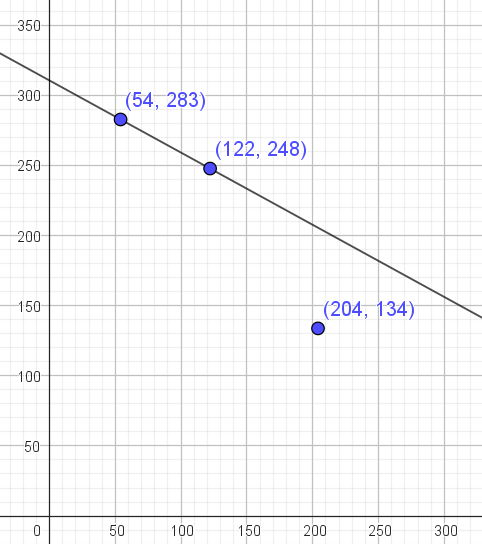
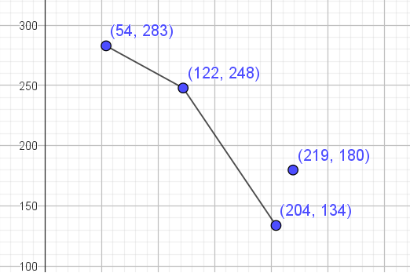
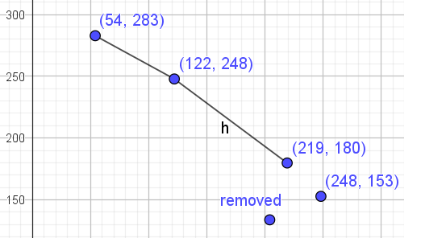
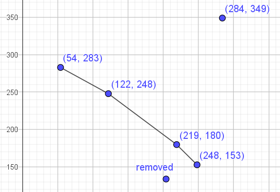
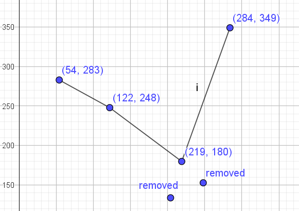
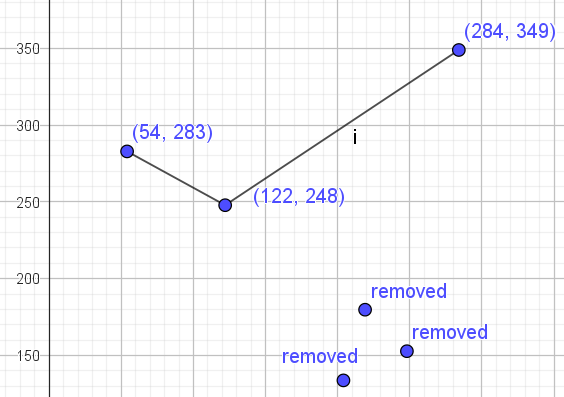
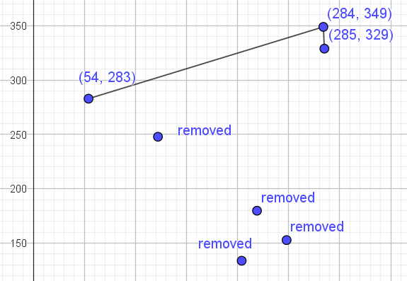
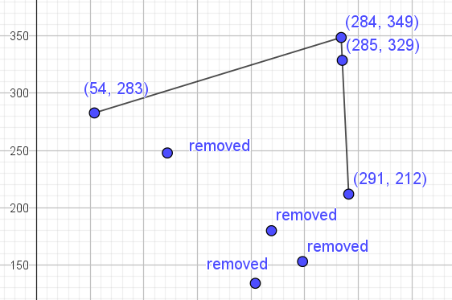
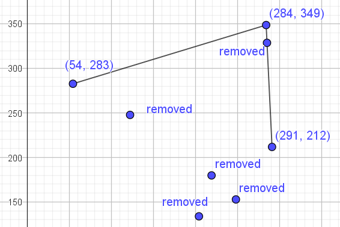
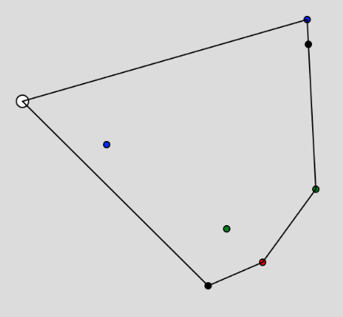

<h2>Convex Hull</h2>

The javascript code is using the js.p5 library for canvas drawing. The number of data points is initially 100, and the user must click the Draw Hull button to see the canvas.  The randomly selected, type real, datapoints are graphed onto a 400 x 400 canvas and inside a range xmin = 50, xmax = 350, ymin = 50, ymax = 350.  

There is an omission in the code such that if two points happen to be identical, then the convex hull will fail.  The program will continue to run, but an erroneous drawing will appear.  Fortunately, using "real" random numbers puts the probability for getting an identical pair at about zero, but if one were to use integer data, it might be needed to exclude duplicates. 

The code runs pretty fast.  10,000 points can be drawn in about 8 ms.  That is the execution time for finding the convex hull, not counting the time to actually draw it.  It makes more sense to look at 10 to 50 points, where one doesn't just always get a nearly perfect rectangle for the hull.  I believe that the perfect rectangle is caused by the "uniform" random distribution using Math.random to generate points.

The method for coding comes from the textbook "Computational Geometry" by Mark de Berg, Otfried Cheong, Marc van Kreveld and Mark Overmars. They provide pseudo-code for two different methods.  This is the second method.  The first one is quite slow.

<h2> Algorithm Overview</h2>

A set of random real datapoints (x,y) is created. Then the points are numerically sorted such that the smallest x values come first.  Furthermore, the y values are also sorted in a similar manner.  When the sorting is finished, the first point in the sorted list will have a smallest x value and a smallest y value. The y value sort is of no value to the routine, but the x value sort assures that the first datapoint will be on the convex hull.  

The approach is go left to right across the field and find the upper hull.  Then we go right to left across the field and find the lower hull.  Then we join the hulls and are done. The insight to how this method works is that as we go across the top of the hull we are always making a right turn.  **What do we mean by a right turn?**  Select any point and draw the line segment (and by extension the line) between the first point, which is on the hull and the selected point. Now select any third point from our set. The third point will be either above or below or on the line. If it is above the line, we call that a left turn.  If it is below the line, we call that a right turn.  We can build the top half of the hull incrementally if we add a point and then ask if the 3rd point resulted in a left or right turn.  If it was right, fine.  If it was left (technically known as "not right"), then we have to remove the middle point and ask the same question about the most recent 3 points.  Let's look at an example.

Here is a small dataset which is already sorted.
(54, 283),(122,24),(204,134),(219,180),(248,153),(284,349),(285,329),(291,212).
We can graph the first three points, draw the line from the 1st to the 2nd, and ask if the 3rd point is to the left (above) or right (below) of the line.

So we could easily code at least this much and we need a function that will answer the question. Here is that function.

Let the 3 points be A,B,P from left to right. 
1) Create two vectors. 
2) $$u = B-A = \binom{B_x -A_x}{B_y-A_y}$$
   $$v = P-A = \binom{P_x - A_x}{P_y-A_y}$$
3) Make these into a matrix and take its determinant:
   $$det(M) = \left| \left( \begin{array}c u_x&v_x\\u_y&v_y \end{array}\right)\right| = u_x\cdot v_y - u_y\cdot v_x$$
4) If the sign is negative, the point P is to the right.  If it is positive, the point P is to the left.  If it is zero, the point P is on the line.
5) If you need an explanation of the math, look it up online.

Since the point was to the right, we include it in our ongoing list for points on the upper Hull. 

 Now lets add the next point (219,180). 
 
It is NOT to the right of the line and our instructions are to remove from our Hull list, the middle point of the last 3 points. That will make the Hull list be 
$$Hull=(54, 283),(122,24),(219,180)$$ 
and we redraw and add a new point.

  
The new point continues to turn right, so we add it to the Hull and get another point.
The latest point addition,(284,349), is clearly going to cause a sharp left turn.
  
By the rules, we delete the middle point of the last three. So (284,153) has to go.
  
But now we see that the new last three points still turn left, so we delete the middle again.
  
And still the last three points turn left. So we continue to delete the middle, but now we are down to only 2 points on the Hull. So we can finally add the next point from our list. 
  
This one makes a right turn so we keep it and add the next point, which turns out to be the last one in our data set.
  

This time, I can't look at the graph and tell whether the turn is to the left or right, but using the last three points, the determinant is positive, so the last turn must have been a left.  Ergo, we remove the middle point to get:
  

This completes the upper hull and we have only two line segments. To do the lower hull, we start over on the right and go left, using all  of the points and beginning with the point (291,212) which we have determined is on the Hull.
The procedure is the same and we must continue to turn right.  The completed Hull looks like this.
  

